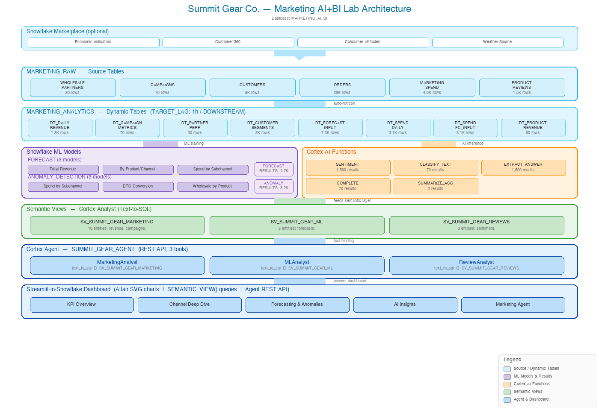

# Summit Gear Co. -- Marketing AI+BI Lab

A 60-minute hands-on lab showcasing Snowflake's AI, ML, Marketplace, Dynamic Tables, and Streamlit capabilities through a marketing analytics scenario.

## Quick Start

> **Doing the lab at a live event?** Snowflake Public Data has already been pre-loaded and the backup Streamlit app is deployed for you. You still need to install the other three Marketplace listings (SMS CustomerConnect 360, GWI Core, Weather Source). Skip Step 1 and jump straight to the Lab Guide -- your facilitator will provide the account details.

### Step 1: Create the Database and Git Integration

> **Live event attendees: This step has already been done for you. Do not execute this -- skip to Step 2.**

As ACCOUNTADMIN, open a SQL worksheet and run:

```sql
USE ROLE ACCOUNTADMIN;

CREATE OR REPLACE DATABASE MARKETING_AI_BI;
CREATE SCHEMA IF NOT EXISTS MARKETING_AI_BI.MARKETING_RAW;

CREATE OR REPLACE API INTEGRATION github_api_integration
  API_PROVIDER = git_https_api
  API_ALLOWED_PREFIXES = ('https://github.com/g-suk')
  ENABLED = TRUE;

CREATE ROLE IF NOT EXISTS MARKETING_LAB_ROLE;
GRANT ROLE MARKETING_LAB_ROLE TO ROLE SYSADMIN;

GRANT OWNERSHIP ON DATABASE MARKETING_AI_BI TO ROLE MARKETING_LAB_ROLE COPY CURRENT GRANTS;
GRANT OWNERSHIP ON SCHEMA MARKETING_AI_BI.MARKETING_RAW TO ROLE MARKETING_LAB_ROLE COPY CURRENT GRANTS;

CREATE SCHEMA IF NOT EXISTS MARKETING_AI_BI.MARKETING_ANALYTICS;
GRANT OWNERSHIP ON SCHEMA MARKETING_AI_BI.MARKETING_ANALYTICS TO ROLE MARKETING_LAB_ROLE COPY CURRENT GRANTS;

CREATE OR REPLACE WAREHOUSE COMPUTE_WH
  WAREHOUSE_SIZE = MEDIUM
  GENERATION = '2'
  AUTO_SUSPEND = 300;

GRANT USAGE ON WAREHOUSE COMPUTE_WH TO ROLE MARKETING_LAB_ROLE;

GRANT DATABASE ROLE SNOWFLAKE.CORTEX_USER TO ROLE MARKETING_LAB_ROLE;
```

### Step 2: Create a Workspace from Git

1. In Snowsight, navigate to **Projects > Workspaces**
2. Click **+ Create Workspace** (top right)
3. Select **Create Workspace from Git Repository**
4. Paste the repository URL: `https://github.com/g-suk/marketing_ai_bi.git`
5. Select **Public Repository** (no credentials needed)
6. If it asks for Database and schema, choose database `MARKETING_AI_BI` and schema `MARKETING_RAW`
7. Click **Create**

You now have a full workspace with all lab SQL files ready to open and run.

### Step 3: Follow the Lab Guide

Open `lab_guide/LAB_GUIDE.md` and work through each part. You'll open each SQL file in the workspace, review what it does, and run it step by step.

## Architecture



## What You'll Build

- **Synthetic dataset:** 6 tables in `MARKETING_RAW` for "Summit Gear Co." (DTC + wholesale outdoor brand)
- **Marketplace enrichment:** Economic indicators, consumer demographics, weather data, consumer attitudes
- **Dynamic tables:** 13 declarative transformation layers in `MARKETING_ANALYTICS` plus 7 materialized derived tables
- **Multi-Touch Attribution:** 5 rule-based attribution models (first/last touch, linear, time-decay, position-based) with journey analysis across 7 sub-channels
- **Marketing Mix Modeling:** Channel attribution, weekly spend decomposition, AI-generated budget recommendations, ROAS targets with reference lines
- **Location-Based Targeting:** Composite Market Opportunity Index geo-scoring, weather-triggered campaigns, per-state AI briefs
- **CLV Risk Classification:** 5-tier customer segmentation with churn risk scoring
- **Cortex ML:** Revenue forecasting (with exogenous weather/economic features) + anomaly detection across 6 models
- **Cortex AI:** Sentiment analysis, classification, extraction, summarization, MMM insights, geo-targeting recommendations
- **Semantic views + Agent:** 4 semantic views (27 entities total) backing a natural language Q&A agent with 4 specialized tools
- **Streamlit dashboard:** 5-page app with KPI Overview, Advanced Analytics (4 tabs: MMM, MTA, Geo-Targeting, CLV & Churn), Forecasting & Anomalies, AI Insights, and Marketing Agent

## Marketplace Listings

Install these free listings from **Data Products > Marketplace** in Snowsight:

| Listing | Database Name |
|---------|--------------|
| [Snowflake Public Data](https://app.snowflake.com/marketplace/listing/GZTSZ290BV255) *(pre-loaded at live events)* | `SNOWFLAKE_PUBLIC_DATA_PAID` |
| [SMS CustomerConnect 360 Sample](https://app.snowflake.com/marketplace/listing/GZT0ZU1ICEX) | `CUSTOMERCONNECT360__SAMPLE` |
| [GWI Core](https://app.snowflake.com/marketplace/listing/GZ2FSZGU5YB) | `GWI_OPEN_DATA` |
| [Weather Source Global Weather](https://app.snowflake.com/marketplace/listing/GZSOZ1LLD8) | `FROSTBYTE_WEATHERSOURCE` |

After installing, grant access:

```sql
USE ROLE ACCOUNTADMIN;
GRANT IMPORTED PRIVILEGES ON DATABASE SNOWFLAKE_PUBLIC_DATA_PAID TO ROLE MARKETING_LAB_ROLE;
GRANT IMPORTED PRIVILEGES ON DATABASE CUSTOMERCONNECT360__SAMPLE TO ROLE MARKETING_LAB_ROLE;
GRANT IMPORTED PRIVILEGES ON DATABASE GWI_OPEN_DATA              TO ROLE MARKETING_LAB_ROLE;
GRANT IMPORTED PRIVILEGES ON DATABASE FROSTBYTE_WEATHERSOURCE    TO ROLE MARKETING_LAB_ROLE;
```

## File Structure

```
sql/
  01_setup/setup.sql                  -- RBAC, role, schemas, stages, 6 source tables
  02_data/02_marketplace_enrichment.sql -- Marketplace snapshot tables
  03_dynamic_tables/01_dynamic_tables.sql -- 13 dynamic tables, 6 derived tables, 6 attribution views
  04_ml/01_forecast.sql               -- FORECAST (3 models: total revenue, product/channel, spend)
  04_ml/02_anomaly_detection.sql      -- ANOMALY_DETECTION (3 models: spend, DTC conversion, wholesale)
  05_ai/01_ai_functions.sql           -- Cortex AI functions (sentiment, classify, extract, summarize, complete)
  06_semantic/01_semantic_view.sql     -- 4 semantic views (marketing, ML, reviews, advanced)
  06_semantic/02_cortex_agent.sql      -- Cortex Agent with 4 text-to-SQL tools
lab_guide/
  LAB_GUIDE.md                        -- Step-by-step instructions
  prompts/01_build_dashboard.md       -- Cortex Code prompt for building the dashboard
  prompts/02_enhancements.md          -- Follow-up enhancement ideas
streamlit/
  streamlit_app.py                    -- Dashboard source code
  environment.yml                     -- SiS conda dependencies
helper_streamlit_skill/SKILL.md       -- SiS runtime constraints and Cortex Agent parser reference
teardown_all.sql                      -- Clean up everything
```

## Schemas

| Schema | Purpose |
|--------|---------|
| `MARKETING_RAW` | Source tables, ML results, AI results, marketplace views, marketplace snapshots |
| `MARKETING_ANALYTICS` | Dynamic tables, MMM tables, MTA touchpoints & attribution views, geo-targeting, CLV risk, semantic views, Cortex Agent, Streamlit app |

## Teardown

```sql
USE ROLE ACCOUNTADMIN;
DROP DATABASE IF EXISTS MARKETING_AI_BI;
DROP ROLE IF EXISTS MARKETING_LAB_ROLE;
```
